# Architecture

```mermaid
flowchart TB
    subgraph src["Source"]
        seek["SEEK job ads<br/>3 scrapes · 550 records"]
    end

    subgraph bronze["Bronze — land as-is"]
        raw["bronze.job_ads<br/>550 rows<br/>+ ingested_at, source_file"]
        dead["bronze.dead_letter<br/>invalid rows + reason"]
    end

    subgraph silver["Silver — clean & conform"]
        clean["silver.job_ads<br/>482 rows<br/>salary parsed · HTML stripped<br/>locations standardised · deduped"]
        clusters["silver.job_clusters<br/>semantic repost groups"]
    end

    subgraph ext["Extract — LLM layer"]
        attrs["extract.job_attrs<br/>seniority · visa · years"]
        eskills["extract.job_skills"]
        golden["golden_set.jsonl<br/>30 hand-labelled"]
        evalr["eval_report.json<br/>skills F1 0.815"]
    end

    subgraph gold["Gold — star schema (dbt)"]
        fact["fact_job_posting<br/>grain: 1 row per posting"]
        dimc["dim_company"]
        diml["dim_location"]
        dimd["dim_date"]
        dims["dim_skill"]
        bridge["bridge_job_skill<br/>many-to-many"]
    end

    subgraph serve["Serve"]
        api["FastAPI CV matcher"]
        li["LinkedIn draft generator"]
    end

    seek --> raw
    raw -.invalid.-> dead
    raw --> clean
    clean --> attrs
    clean --> eskills
    clean --> clusters
    attrs --> fact
    golden --> evalr
    attrs -.scored against.-> evalr
    clean --> fact
    fact --- dimc
    fact --- diml
    fact --- dimd
    fact --- bridge
    bridge --- dims
    fact --> api
    clusters --> api
    fact --> li

    style bronze fill:#3d2f1f,stroke:#8a6d3b
    style silver fill:#2a2f38,stroke:#6c7a89
    style gold fill:#3d3a1f,stroke:#b8952f
    style ext fill:#2b2438,stroke:#7d5ba6
    style serve fill:#1f3d2b,stroke:#4caf50
```

## Orchestration (Dagster asset graph)

```mermaid
flowchart LR
    b["bronze_job_ads"] --> s["silver_job_ads"]
    s --> l["llm_extraction"]
    s --> c["semantic_clusters"]
    s --> g["gold_star_schema"]
    l --> g
    l --> e["extraction_eval"]
    g -.asset check.-> f{{"gold_is_fresh<br/>SLA: 8 days"}}

    style g fill:#3d3a1f,stroke:#b8952f
    style f fill:#4a2323,stroke:#e05252
```

Weekly schedule: Mondays 06:00 (`0 6 * * 1`).

## Design decisions

| Decision | Rationale |
|---|---|
| DuckDB rather than Postgres or Spark | Workload is a weekly batch of ~500 rows. An embedded, columnar engine matches the scale; a database server would add operational overhead with no benefit at this volume. |
| Medallion layering | Bronze is never modified, so a defect in cleaning logic is recoverable by rerunning from source rather than re-scraping. |
| Star schema rather than a single flat table | Reduces multi-way analytical queries (e.g. top skills by role) to a single join. Dimension tables store company and location text once rather than repeating it per fact row. |
| Bridge table for skills | A posting has multiple skills and a skill appears across multiple postings — a many-to-many relationship that neither a column nor a single foreign key can represent. |
| Surrogate integer keys | Company names are inconsistent and can change; a stable generated key is a safer join target. |
| `CREATE OR REPLACE` rather than `INSERT` | Makes each pipeline stage idempotent by construction rather than by convention. |
| Hourly and daily salaries stored raw, not annualised | Annualising requires assuming full-time hours the posting does not state. Storing the raw figure with a `salary_period` label avoids introducing an unstated assumption into the data. |
| Dead-letter table instead of dropping invalid rows | A silently dropped row is undetectable data loss. Quarantining preserves both the row and the validation failure reason. |
| LLM calls cached by content hash | Reruns are free and deterministic. |
| LinkedIn generator produces a draft only | Automated publishing to a personal account was judged out of scope for a scheduled job. |
