# Architecture

```mermaid
flowchart TB
    subgraph src["Source"]
        seek["SEEK job ads<br/>3 scrapes · 550 records"]
    end

    subgraph bronze["Bronze — land as-is"]
        raw["bronze.job_ads<br/>550 rows<br/>+ ingested_at, source_file"]
        dead["bronze.dead_letter<br/>invalid rows + reason"]
    end

    subgraph silver["Silver — clean & conform"]
        clean["silver.job_ads<br/>482 rows<br/>salary parsed · HTML stripped<br/>locations standardised · deduped"]
        clusters["silver.job_clusters<br/>semantic repost groups"]
    end

    subgraph ext["Extract — LLM layer"]
        attrs["extract.job_attrs<br/>seniority · visa · years"]
        eskills["extract.job_skills"]
        golden["golden_set.jsonl<br/>30 hand-labelled"]
        evalr["eval_report.json<br/>skills F1 0.815"]
    end

    subgraph gold["Gold — star schema (dbt)"]
        fact["fact_job_posting<br/>grain: 1 row per posting"]
        dimc["dim_company"]
        diml["dim_location"]
        dimd["dim_date"]
        dims["dim_skill"]
        bridge["bridge_job_skill<br/>many-to-many"]
    end

    subgraph serve["Serve"]
        api["FastAPI CV matcher"]
        li["LinkedIn draft generator"]
    end

    seek --> raw
    raw -.invalid.-> dead
    raw --> clean
    clean --> attrs
    clean --> eskills
    clean --> clusters
    attrs --> fact
    golden --> evalr
    attrs -.scored against.-> evalr
    clean --> fact
    fact --- dimc
    fact --- diml
    fact --- dimd
    fact --- bridge
    bridge --- dims
    fact --> api
    clusters --> api
    fact --> li

    style bronze fill:#3d2f1f,stroke:#8a6d3b
    style silver fill:#2a2f38,stroke:#6c7a89
    style gold fill:#3d3a1f,stroke:#b8952f
    style ext fill:#2b2438,stroke:#7d5ba6
    style serve fill:#1f3d2b,stroke:#4caf50
```

## Orchestration (Dagster asset graph)

```mermaid
flowchart LR
    b["bronze_job_ads"] --> s["silver_job_ads"]
    s --> l["llm_extraction"]
    s --> c["semantic_clusters"]
    s --> g["gold_star_schema"]
    l --> g
    l --> e["extraction_eval"]
    g -.asset check.-> f{{"gold_is_fresh<br/>SLA: 8 days"}}

    style g fill:#3d3a1f,stroke:#b8952f
    style f fill:#4a2323,stroke:#e05252
```

Weekly schedule: Mondays 06:00 (`0 6 * * 1`).

## Design decisions

| Decision | Why |
|---|---|
| DuckDB, not Postgres/Spark | Weekly batch of ~500 rows. An embedded, columnar engine matches the workload; a server would be operational overhead for nothing. |
| Medallion layers | Bronze stays untouched so a bug in cleaning logic is always recoverable by re-running from source rather than re-scraping. |
| Star schema, not one flat table | "Top 15 skills for DE roles" is one join away instead of unanswerable. Dimensions keep company/location text stored once. |
| Bridge table for skills | A job has many skills and a skill has many jobs. Neither a column nor a foreign key can express that. |
| Surrogate integer keys | Company names are messy and mutable; a stable integer is the safe join target. |
| `CREATE OR REPLACE`, not `INSERT` | Makes every stage idempotent by construction, not by convention. |
| Hourly/daily salaries kept raw | Annualising requires assuming full-time hours the ad never states. A `salary_period` label is honest; a guessed number is silent corruption. |
| Dead-letter, not drop | A silently dropped row is invisible data loss. Quarantine keeps the row *and* the reason, so bad data is countable and recoverable. |
| Cache LLM calls by content hash | Reruns cost $0 and are deterministic. |
| Draft-only LinkedIn bot | A cron job should not have publish rights to a personal brand. |
